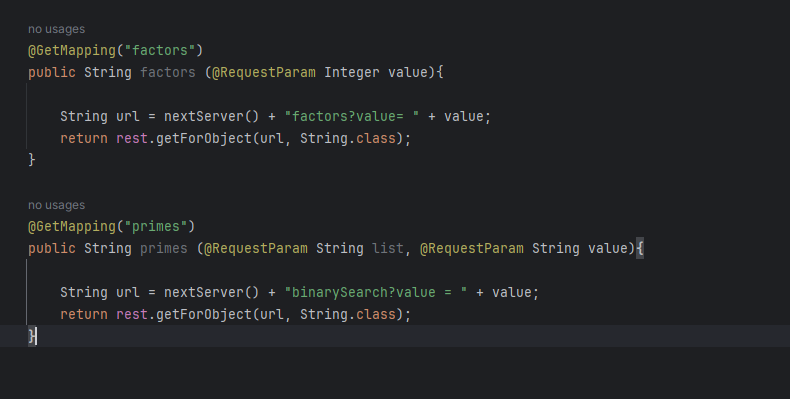

# Parcial 2 AREP
## Julian Santiago Cardenas

--- 

Requisitos de ejecucion
- Maven
- Java 17

Herramientas utilizadas
- AWS
- Springboot
- Java
- Intellij

Creacion de klas instanciass en AWS:

Realizmos el reto matematico en Sprinboot usando java, los cuales se prueban localmente usando POSTMAN:

Iniciamos con la programacion de nuestro servidor de Proxy:

Subimmos utilizando git hub, y corremos la primera instancia:

Hacemos lo mismo con la segunda instancia:

Ahora corremos y verificamos su funcionamiento:

